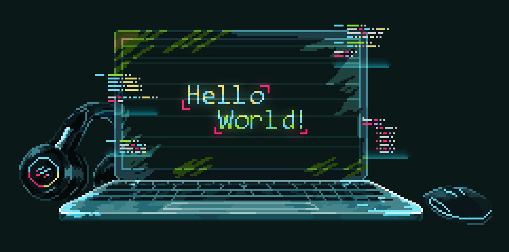

  
# Olá, meu nome é Lucas! 

---

👷 Electrical Engineer   
🤖 Developer RPA (Robotic Process Automation)  
📚 Aprendendo Python 
📫 Contato: lucas.paulino100@gmail.com  

---  

  <a href="https://github.com/lucaspaulinosilva">
  
  

  
 

 Tecnologias e soluções que utilizo:
  
 RPA | SQL | VBScript | JavaScript | Python | C# | Java
     

   
  
  
  
  
  
  
  

  

---

   
  
  
  

 
